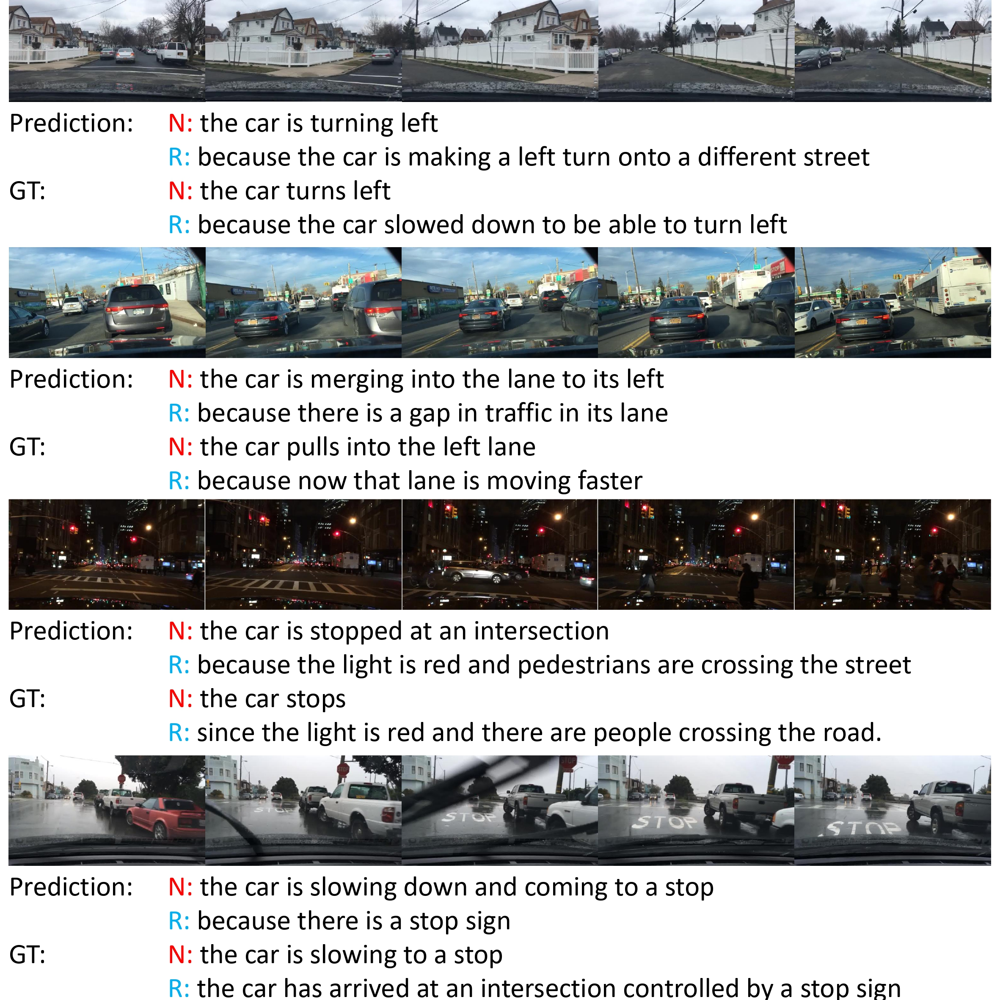

# ADAPT: Action-aware Driving Caption Transformer

  

This repository is an official implementation of [ADAPT: Action-aware Driving Caption Transformer](https://arxiv.org/abs/2302.00673), accepted by ICRA 2023.

Created by Bu Jin, Xinyu Liu, Yupeng Zheng, Pengfei Li, Hao Zhao, Tong Zhang, Yuhang Zheng, Guyue Zhou and Jingjing Liu from Institute for [AI Industry Research(AIR), Tsinghua University](https://air.tsinghua.edu.cn/).

## Introduction

We propose an end-to-end transformer-based architecture, ADAPT (Action-aware Driving cAPtion Transformer), which provides **user-friendly** natural language narrations and reasoning for autonomous vehicular control and action. ADAPT jointly trains both the driving caption task and the vehicular control prediction task, through a shared video representation. 

This repository contains the training and testing of the proposed framework in paper, as well as the demo in smulator environment and real word.

## Note
This reposity will be updated soon, including:
- [x] Uploading the **[Preprocessed Data](#dataset-preparation)** of BDDX.
- [ ] Uploading the **Raw Data** of BDDX, along with an easier processing script.
- [ ] Uploading the **Visualization Codes** of raw data and results.
- [ ] Updating the **Experiment Codes** to make it easier to get up with.
- [x] Uploading the **[Conda Environments](#1.-installation-as-conda)** of ADAPT.


## Table of contents
- [ADAPT: Action-aware Driving Caption Transformer](#adapt-action-aware-driving-caption-transformer)
  - [Introduction](#introduction)
  - [Table of contents](#table-of-contents)
  - [Getting Started](#getting-started)
    - [Launch Docker Container](#launch-docker-container)
  - [Models](#models)
  - [Requirements](#requirements)
  - [Dataset Preparation](#dataset-preparation)
  - [Quick Demo](#quick-demo)
  - [Evaluation](#evaluation)
  - [Training](#training)
    - [Basic Model](#basic-model)
    - [Only DCG(Driving Caption Generation) Head](#only-dcgdriving-caption-generation-head)
    - [Only CSP(Control signal prediction) Head](#only-cspcontrol-signal-prediction-head)
    - [Only Predicting One Sentence (instead of both narration\\description and reasoning\\explanation)](#only-predicting-one-sentence-instead-of-both-narrationdescription-and-reasoningexplanation)
  - [Qualititive results](#qualititive-results)
  - [Citation](#citation)
  - [Acknowledgments](#acknowledgments)


## Getting Started


### 1. Installation as Conda

Create conda environment:
```
conda env create --name ADAPT python=3.8
```

Install torch:
```
pip install torch==1.13.1+cu116 torchaudio==0.13.1+cu116 torchvision==0.14.1+cu116 -f https://download.pytorch.org/whl/torch_stable.html
```

Install apex:
```
git clone https://github.com/NVIDIA/apex
cd apex
pip install -v --no-cache-dir ./
cd ..
rm -rf apex
```

Then install other dependency:
```
pip install -r requirements.txt
```

### 2. Launch Docker Container

<!-- ### Launch Docker Container -->

We provide a [Docker image](https://hub.docker.com/r/jxbbb/adapt/tags) to make it easy to get up. Before you run the `launch_container.sh`, please ensure the directory name is right in `launch_container.sh` and your current directory.


```bash
sh launch_container.sh
```

Our latest docker image `jxbbb/adapt:latest` is adapted from `linjieli222/videocap_torch1.7:fairscale`, which supports the following mixed precision training
- [x] Torch.amp
- [x] Nvidia Apex O2
- [x] deepspeed
- [x] fairscale


## Models

* We release our best performing checkpoints. You can download these models at [ [Google Drive](https://drive.google.com/drive/folders/1GYO9MVgrDMBUXdULgs5mzmcpDstAGCn4?usp=share_link) ] and place them under `checkpoints` directory. If the directory does not exist, you can create one.

* We release the base video-swin models we used during training in [ [Google Drive](https://drive.google.com/drive/folders/1yQ2qxxXFZjeq67566XayTnk0yRCJCkJZ?usp=share_link) ]. If you want to use other pretrained video-swin models, you can refer to [Video-Swin-Transformer](https://github.com/SwinTransformer/Video-Swin-Transformer#results-and-models).


## Requirements 
We provide a [Docker image](https://hub.docker.com/r/jxbbb/adapt/tags) for easier reproduction. Please install the following:
  - [nvidia driver](https://docs.nvidia.com/cuda/cuda-installation-guide-linux/index.html#package-manager-installation) (418+), 
  - [Docker](https://docs.docker.com/install/linux/docker-ce/ubuntu/) (19.03+), 
  - [nvidia-container-toolkit](https://github.com/NVIDIA/nvidia-docker#quickstart).

We only support Linux with NVIDIA GPUs. We test on Ubuntu 18.04 and V100 cards.
We use mixed-precision training hence GPUs with Tensor Cores are recommended.
Our scripts require the user to have the [docker group membership](https://docs.docker.com/install/linux/linux-postinstall/)
so that docker commands can be run without sudo.

## Dataset Preparation

You can ether download the preprocessed data in [this site](https://pan.baidu.com/s/1_eW-kLVBhf8lWGObGa4i9A?pwd=7zrz), or just download the raw videos and car information in [this site](https://github.com/JinkyuKimUCB/BDD-X-dataset), and preprocess it with the code in `src/prepro`:


The resulting data structure should follow the hierarchy as below.

```bash
${REPO_DIR}
|-- checkpoints
|-- datasets  
|   |-- BDDX
|   |   |-- frame_tsv
|   |   |-- captions_BDDX.json
|   |   |-- training_32frames_caption_coco_format.json
|   |   |-- training_32frames.yaml
|   |   |-- training.caption.lineidx
|   |   |-- training.caption.lineidx.8b
|   |   |-- training.caption.linelist.tsv
|   |   |-- training.caption.tsv
|   |   |-- training.img.lineidx
|   |   |-- training.img.lineidx.8b
|   |   |-- training.img.tsv
|   |   |-- training.label.lineidx
|   |   |-- training.label.lineidx.8b
|   |   |-- training.label.tsv
|   |   |-- training.linelist.lineidx
|   |   |-- training.linelist.lineidx.8b
|   |   |-- training.linelist.tsv
|   |   |-- validation...
|   |   |-- ...
|   |   |-- validation...
|   |   |-- testing...
|   |   |-- ...
|   |   |-- testing...
|-- datasets_part
|-- docs
|-- models
|   |-- basemodel
|   |-- captioning
|   |-- video_swin_transformer
|-- scripts 
|-- src
|-- README.md 
|-- ... 
|-- ... 
```


## Quick Demo
We provide a demo to run end-to-end inference on the test video.

Our inference code will take a video as input, and generate video caption.

```bash
sh scripts/inference.sh
```

The prediction should look like

```bash
Prediction: The car is stopped because the traffic light turns red.
```

## Evaluation

We provide example scripts to evaluate pre-trained checkpoints.

```bash
# Assume in the docker container 
sh scripts/BDD_test.sh
```


## Training

We provide example scripts to train our model in different sets. 

### Basic Model

```bash
# Assume in the docker container 
sh scripts/BDDX_multitask.sh
```

### Only DCG(Driving Caption Generation) Head

```bash
# Assume in the docker container 
sh scripts/BDDX_only_caption.sh
```

### Only CSP(Control signal prediction) Head

```bash
# Assume in the docker container 
sh scripts/BDDX_only_signal.sh
```

### Only Predicting One Sentence (instead of both narration\description and reasoning\explanation)

```bash
# Assume in the docker container 
sh scripts/BDDX_multitask_des.sh
sh scripts/BDDX_multitask_exp.sh
```
Remember that this two commands require two additional testing data. The data suructure should be:

```bash
${REPO_DIR} 
|-- datasets
|   |-- BDDX
|   |-- BDDX_des
|   |-- BDDX_exp
```

## Qualititive results
  

## Citation

If you find our work useful in your research, please consider citing:

```bibtex
@article{jin2023adapt,
  title={ADAPT: Action-aware Driving Caption Transformer},
  author={Jin, Bu and Liu, Xinyu and Zheng, Yupeng and Li, Pengfei and Zhao, Hao and Zhang, Tong and Zheng, Yuhang and Zhou, Guyue and Liu, Jingjing},
  journal={arXiv preprint arXiv:2302.00673},
  year={2023}
}
```


## Acknowledgments

Our code is built on top of open-source GitHub repositories. 
We thank all the authors who made their code public, which tremendously accelerates our project progress. 
If you find these works helpful, please consider citing them as well.

[Microsoft/SwinBERT](https://github.com/microsoft/SwinBERT) 

[JinkyuKimUCB/BDD-X-dataset](https://github.com/JinkyuKimUCB/BDD-X-dataset)

[huggingface/transformers](https://github.com/huggingface/transformers) 

[Microsoft/DeepSpeed](https://github.com/microsoft/DeepSpeed)

[Nvidia/Apex](https://github.com/NVIDIA/apex)

[FAIR/FairScale](https://github.com/facebookresearch/fairscale)

